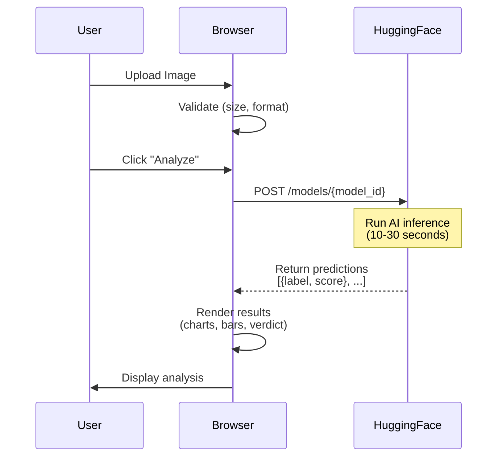

# 🔍 TruthLens - AI Image Forensic Analysis

**Democratizing Digital Integrity**

TruthLens is a zero-cost, client-side web application that detects image tampering, deepfakes, and AI-generated content using Hugging Face's free inference API.

  

---

## 🎯 Features

### Current MVP (Phase 1)
- ✅ **Multi-Provider AI Support** - Choose your preferred backend
  - 🟢 **TensorFlow.js** (Recommended) - Runs 100% in browser, no API key needed
  - 🔵 **Hugging Face** - Free tier with state-of-the-art models
  - 🟣 **Replicate** - Pay-per-use with free credits
- ✅ **Client-Side Processing** - No backend required, runs entirely in your browser
- ✅ **Multiple Detection Models** per provider
- ✅ **Real-Time Analysis** - Get results in 10-30 seconds
- ✅ **Visual Results Dashboard** - Confidence scores, charts, and verdict cards
- ✅ **Global Intelligence Panel** - Educational threat statistics
- ✅ **Privacy-First** - Your images never touch our servers (when using TensorFlow.js)
- ✅ **Forensic UI** - Professional, scientific aesthetic
- ✅ **Works Offline** - TensorFlow.js mode works without internet (after initial load)

### 🔮 Future Phases
- **Phase 2**: CSS-based simulation of ELA (Error Level Analysis) filters
- **Phase 3**: Production stack with FastAPI, Celery, GPU workers, and PostgreSQL

---

## 🚀 Quick Start

### Prerequisites
- A modern web browser (Chrome, Firefox, Edge, Safari)
- **Optional**: A free API account for enhanced features
  - [Hugging Face](https://huggingface.co/join) (Recommended for deepfake detection)
  - [Replicate](https://replicate.com) (Alternative option)

### Setup (2 minutes)

**Option 1: Zero Setup (TensorFlow.js)**
1. Just open [index.html](index.html) in your browser
2. Upload an image and analyze!
3. No API key needed, works 100% offline

**Option 2: With API Providers (More Accurate)**

1. **Get Your API Token** (Choose one):
   
   **Hugging Face:**
   - Go to [huggingface.co/settings/tokens](https://huggingface.co/settings/tokens)
   - Click "New token" → Name it "TruthLens" → Select **Read** permissions
   - Copy the token (starts with `hf_...`)
   
   **Replicate:**
   - Go to [replicate.com/account/api-tokens](https://replicate.com/account/api-tokens)
   - Click "Create token"
   - Copy the token (starts with `r8_...`)

2. **Deploy to GitHub Pages** (or just use locally)
   ```bash
   git clone https://github.com/yourusername/truthlens.git
   cd truthlens
   git add .
   git commit -m "Initial commit"
   git push origin main
   ```

3. **Enable GitHub Pages**
   - Go to your repository → Settings → Pages
   - Source: Deploy from branch `main` → `/root`
   - Save and wait ~2 minutes
   - Your site will be live at `https://yourusername.github.io/truthlens`

4. **Configure the App**
   - Open the deployed site (or local file)
   - **For TensorFlow.js**: No configuration needed! Just start uploading images.
   - **For API providers**: 
     - Click "Settings" in the header
     - Select your provider (Hugging Face or Replicate)
     - Paste your API token
     - Select a detection model
     - Click "Save Configuration"

5. **Start Analyzing!**
   - Upload an image (JPG/PNG/WebP, max 10MB)
   - Click "Start Forensic Analysis"
   - View results in 10-30 seconds

---

## 📂 Project Structure

```
truthlens/
├── index.html                  # Main HTML structure + Tailwind CSS
├── app.js                      # Client-side JavaScript logic
├── README.md                   # Main documentation
├── QUICKSTART.md              # 🚀 Fast setup guide
├── PROVIDER_COMPARISON.md     # 🔄 Compare AI providers
├── TROUBLESHOOTING.md         # 🔧 Fix common issues
├── LICENSE                     # MIT License
└── .gitignore                 # Git configuration
```

**Total Files**: 8  
**Total Size**: ~100KB (uncompressed)  
**Dependencies**: None (all loaded via CDN)

---

## 📚 Documentation

- **Quick Start**: See [QUICKSTART.md](QUICKSTART.md) for 30-second setup
- **Provider Guide**: See [PROVIDER_COMPARISON.md](PROVIDER_COMPARISON.md) to choose the best AI backend
- **Troubleshooting**: See [TROUBLESHOOTING.md](TROUBLESHOOTING.md) if something goes wrong

---

## 🎨 Design Philosophy

### Color Palette
- **Warm Neutrals**: Sand/Beige/Stone backgrounds (reduce eye strain)
- **Semantic Accents**:
  - 🟢 **Teal** (#0d9488): Verified/Authentic/Safe
  - 🟡 **Amber** (#f59e0b): Suspicious/Warning
  - 🔴 **Rose** (#dc2626): Danger/Fake/Tampered

### UI Principles
- Clean, dashboard-style layout
- Forensic/scientific aesthetic (avoiding "hacker" clichés)
- Accessibility-first (WCAG 2.1 AA compliant)
- Mobile-responsive (works on tablets and phones)

---

## 🛠️ Tech Stack

### Current MVP
| Layer | Technology |
|-------|------------|
| **Frontend** | HTML5, Vanilla JavaScript, Tailwind CSS (CDN) |
| **Visualization** | Chart.js 4.4.1 |
| **AI Engines** | TensorFlow.js 4.17 (MobileNet), Hugging Face API, Replicate API |
| **Hosting** | GitHub Pages (or local file) |
| **Auth** | None (tokens stored in `localStorage`) |
| **Database** | None (results are ephemeral) |

### Future Production Stack
| Layer | Technology |
|-------|------------|
| **Frontend** | Next.js 14+ (TypeScript), Shadcn/UI, TanStack Query |
| **Backend** | Python FastAPI, Pydantic validation |
| **Queue** | Redis + Celery |
| **AI Workers** | PyTorch, OpenCV, ExifTool (on GPU servers) |
| **Storage** | AWS S3 (images), PostgreSQL (metadata) |
| **DevOps** | Docker, Kubernetes, GitHub Actions |

---

## 🔒 Privacy & Security

### What We DON'T Collect
- ❌ Your uploaded images (never stored on our servers)
- ❌ Your API token (stored only in your browser's `localStorage`)
- ❌ Personal information
- ❌ Analytics or tracking data

### What Happens to Your Data
1. **Your Browser** → Reads the image file
2. **Your Browser** → Sends image directly to **Hugging Face's API**
3. **Hugging Face** → Runs the AI model and returns results
4. **Your Browser** → Displays results (then forgets everything on refresh)

**Important**: By using TruthLens, you agree to [Hugging Face's Terms of Service](https://huggingface.co/terms-of-service). Images are processed according to their privacy policy.

### Security Best Practices
- **Never share your API token** with anyone
- **Use Read-only tokens** (not Write tokens)
- **Don't upload sensitive/private images** to public services
- **Revoke tokens** if compromised at [huggingface.co/settings/tokens](https://huggingface.co/settings/tokens)

---

## 🧪 Supported Models

TruthLens supports multiple AI providers with different models:

### 🟢 TensorFlow.js (No API Key)
| Model | Specialization | Privacy |
|-------|----------------|---------|
| MobileNet | General image classification | 🔒 100% Private (runs in browser) |

### 🔵 Hugging Face
| Model | Provider | Specialization |
|-------|----------|----------------|
| `umm-maybe/AI-image-detector` | umm-maybe | General AI-generated content |
| `prithivMLmods/Deepfake-Image-Detection` | prithivML | Face swaps & deepfakes |
| `Organika/sdxl-detector` | Organika | Stable Diffusion XL outputs |

### 🟣 Replicate
| Model | Specialization |
|-------|----------------|
| BLIP-2 | Image captioning & analysis |
| BLIP | Image understanding |

**Add Custom Models**: Edit the `PROVIDERS` object in [app.js](app.js) to add more models.

---

## 📊 How It Works



### API Response Format
```json
[
  { "label": "artificial", "score": 0.9823 },
  { "label": "human", "score": 0.0177 }
]
```

---

## 🐛 Troubleshooting

### General Issues

**"Provider not available" or connection errors**
- Switch to **TensorFlow.js** mode (works offline, no API needed)
- Check your internet connection for API-based providers
- Verify the provider's service status

### TensorFlow.js Issues

**"Model failed to load"**
- Ensure you have internet for the initial model download
- Clear browser cache and reload
- Try a different browser (Chrome recommended)

**Results seem generic**
- TensorFlow.js uses general image classification, not deepfake-specific
- For better accuracy, use Hugging Face with specialized models

### Hugging Face Issues

**"Invalid API token" Error**
- Ensure token starts with `hf_`
- Check token permissions at [huggingface.co/settings/tokens](https://huggingface.co/settings/tokens)
- Verify token hasn't been revoked

### "Model is loading" Error (503)
- Hugging Face models "cold start" when idle
- **Solution**: Wait 20 seconds and try again
- Subsequent requests will be faster

### "Rate limit exceeded" Error (429)
- Free tier has limited requests per hour
- **Solution**: Wait a few minutes, or upgrade to Hugging Face Pro

### Image Upload Fails
- Check file size (max 10MB)
- Ensure format is JPG, PNG, or WebP
- Try a different browser

### Results Look Wrong
- Different models specialize in different content types
- Try switching models in Settings
- Some models may be less accurate than others

---

## 🤝 Contributing

We welcome contributions! Here's how:

1. **Fork the repository**
2. **Create a feature branch**: `git checkout -b feature/amazing-feature`
3. **Commit your changes**: `git commit -m 'Add amazing feature'`
4. **Push to branch**: `git push origin feature/amazing-feature`
5. **Open a Pull Request**

### Development Guidelines
- Keep the MVP **zero-cost** (no paid services)
- Maintain vanilla JS (no frameworks for Phase 1)
- Follow the forensic UI aesthetic
- Test across browsers (Chrome, Firefox, Safari)

---

## 📜 License

This project is licensed under the **MIT License** - see the [LICENSE](LICENSE) file for details.

**TL;DR**: You can use, modify, and distribute this code freely. Just give credit!

---

## 🎓 Educational Use Only

**IMPORTANT DISCLAIMER**:
- TruthLens is a **research and educational tool**
- Results are **probabilistic**, not absolute proof
- **Do NOT use for legal evidence** without professional verification
- False positives/negatives are possible
- Always verify critical content through multiple sources

---

## 🌟 Roadmap

### ✅ Phase 1: Zero-Cost MVP (Current)
- [x] Client-side architecture
- [x] Hugging Face API integration
- [x] Visual results dashboard
- [x] GitHub Pages deployment

### 🔄 Phase 2: Simulation Prototype (In Progress)
- [ ] CSS-based ELA filter simulation
- [ ] Noise pattern visualization
- [ ] Pre-loaded case files (Real vs Fake examples)
- [ ] Scanning animations

### 🔮 Phase 3: Production System (Future)
- [ ] FastAPI backend
- [ ] Celery task queue
- [ ] GPU workers (PyTorch)
- [ ] Real ELA/metadata extraction (OpenCV, ExifTool)
- [ ] PostgreSQL database
- [ ] User authentication (OAuth)
- [ ] WebSocket real-time updates
- [ ] Kubernetes deployment

---

## 👨‍💻 About

**TruthLens** was created to combat misinformation by making image forensics accessible to everyone—journalists, researchers, and everyday users.

**Built with** ❤️ **by developers who believe in digital transparency**

---

## 📞 Support

- 📧 **Email**: support@truthlens.io (Coming soon)
- 🐛 **Issues**: [GitHub Issues](https://github.com/yourusername/truthlens/issues)
- 💬 **Discussions**: [GitHub Discussions](https://github.com/yourusername/truthlens/discussions)

---

## 🙏 Acknowledgments

- **Hugging Face** for providing free API access
- **Tailwind CSS** for the design system
- **Chart.js** for data visualization
- The open-source AI/ML community

---

**⚡ Ready to detect deepfakes? [Try TruthLens Now](https://yourusername.github.io/truthlens)**
